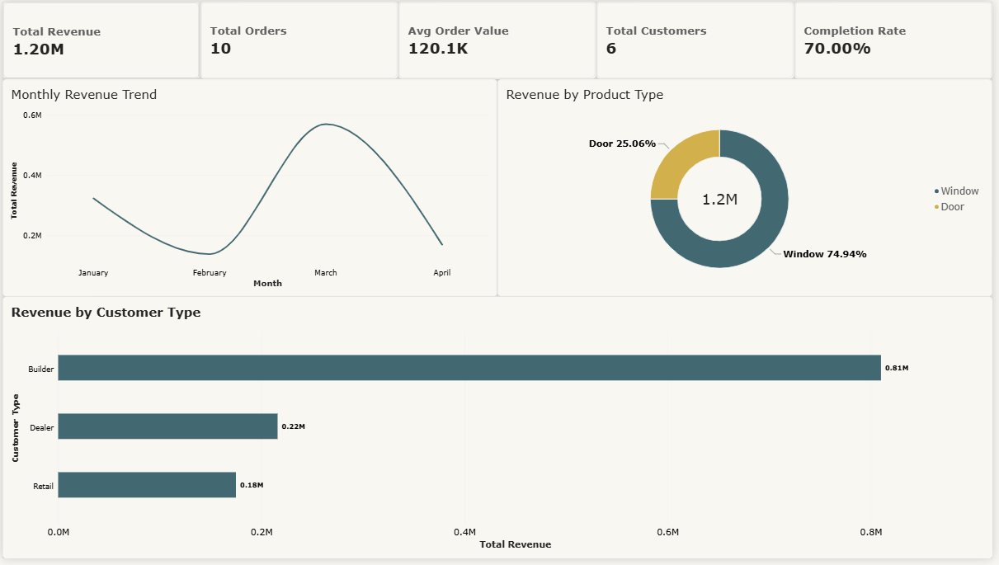
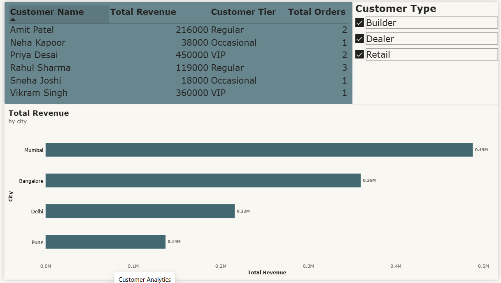
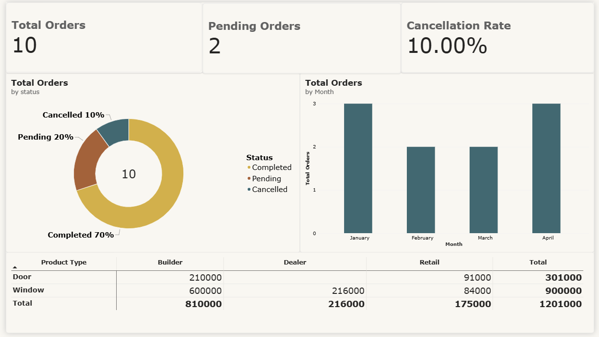

# Power BI Dashboard — UPVC Manufacturing

Interactive 3-page dashboard built on the UPVC manufacturing database.

## 📊 Dashboard Pages

### Page 1 — Executive Summary


**Key metrics:**
- Total Revenue: ₹1.20M INR
- Total Orders: 10
- Avg Order Value: ₹120.1K INR
- Completion Rate: 70%

**Visuals:** Monthly revenue trend, product mix (Window vs Door), revenue by customer type.

---

### Page 2 — Customer Analytics


**Key insights:**
- Top customers ranked by revenue with automatic VIP/Regular/Occasional tiering
- Mumbai is the top revenue city (₹0.49M), followed by Bangalore (₹0.36M)

**Visuals:** Customer detail table with tier, revenue by city, filter by customer type.

---

### Page 3 — Operations


**Key insights:**
- 70% of orders completed, 20% pending, 10% cancelled
- Builders are the dominant segment (₹810K of ₹1.2M revenue)

**Visuals:** Order status breakdown, monthly order trend, product × customer type matrix.

---

## 🛠️ Built With

- **Power BI Desktop**
- **DAX** for measures: Total Revenue, Customer Tier, Completion Rate, Cancellation Rate
- **Power Query** for data cleaning (data types, trimming, removing blanks)

## 📁 Files in this Folder

| File | Description |
|------|-------------|
| `upvc_dashboard.pbix` | Source Power BI file |
| `page1_executive.png` | Executive Summary screenshot |
| `page2_customers.png` | Customer Analytics screenshot |
| `page3_operations.png` | Operations screenshot |

## 🔍 Key DAX Measures Used

```dax
Total Revenue = SUM(orders[amount])

Total Orders = COUNT(orders[order_id])

Avg Order Value = DIVIDE([Total Revenue], [Total Orders])

Completion Rate = DIVIDE([Completed Orders], [Total Orders])

Customer Tier = 
SWITCH(TRUE(),
    [Total Revenue] > 250000, "VIP",
    [Total Revenue] >= 100000, "Regular",
    "Occasional"
)
